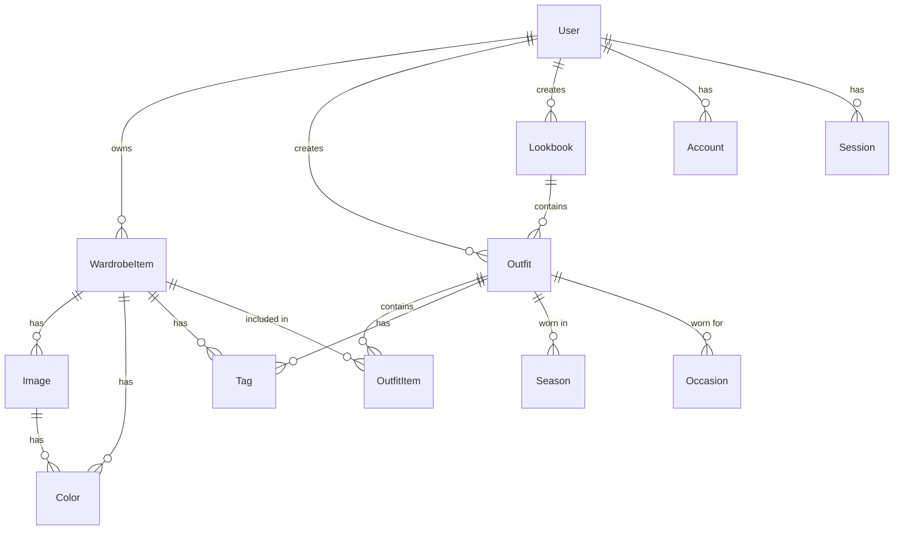

# Database Schema Documentation

## Overview

Fitbook uses PostgreSQL as its primary database, managed through Prisma ORM. The schema is designed to support complex relationships between wardrobe items, outfits, and user data while maintaining data integrity and query performance.

## Entity Relationship Diagram



## Tables

### User
Primary table for user information and preferences.

```prisma
model User {
  id                String        @id @default(cuid())
  name             String?
  username         String?       @unique
  email            String?       @unique
  emailVerified    DateTime?
  image            String?
  bio              String?       @db.Text
  location         String?
  website          String?
  instagram        String?
  pinterest        String?
  tiktok           String?
  currency         String        @default("USD")
  language         String        @default("en")
  emailNotifications Boolean     @default(true)
  publicProfile    Boolean       @default(false)
  darkMode         Boolean       @default(false)
  totalSpent       Float         @default(0)
  featuredOutfits  String[]
  featuredLookbook String?
  accounts         Account[]
  sessions         Session[]
  wardrobe         WardrobeItem[]
  outfits          Outfit[]
  lookbooks        Lookbook[]
  createdAt        DateTime      @default(now())
  updatedAt        DateTime      @updatedAt
}
```

### WardrobeItem
Stores individual clothing items in a user's wardrobe.

```prisma
model WardrobeItem {
  id               String        @id @default(cuid())
  name             String
  category         String
  brand            String?
  price            Float
  purchaseUrl      String?
  size             String?
  material         String?
  condition        String?
  isOwned          Boolean       @default(true)
  purchaseDate     DateTime?
  purchaseLocation String?
  retailPrice      Float?
  onSale           Boolean?
  lastWorn         DateTime?
  timesWorn        Int           @default(0)
  wearDates        DateTime[]
  careInstructions String?       @db.Text
  dryCleanOnly     Boolean       @default(false)
  lastCleaned      DateTime?
  fitRating        Int?
  fitNotes         String?       @db.Text
  notes            String?       @db.Text
  userId           String
  user             User          @relation(fields: [userId], references: [id], onDelete: Cascade)
  images           Image[]
  colors           Color[]
  tags             Tag[]
  outfitItems      OutfitItem[]
  seasons          Season[]
  occasions        Occasion[]
  createdAt        DateTime      @default(now())
  updatedAt        DateTime      @updatedAt
}
```

### Image
Stores image information for wardrobe items.

```prisma
model Image {
  id            String       @id @default(cuid())
  url           String
  publicId      String
  isPrimary     Boolean     @default(false)
  wardrobeItem  WardrobeItem @relation(fields: [itemId], references: [id], onDelete: Cascade)
  itemId        String
  colors        Color[]
}
```

### Color
Stores color information for images and items.

```prisma
model Color {
  id             String        @id @default(cuid())
  hex            String
  name           String?
  wardrobeItems  WardrobeItem[]
  images         Image[]
}
```

### Outfit
Stores outfit combinations created by users.

```prisma
model Outfit {
  id             String       @id @default(cuid())
  name           String
  description    String?      @db.Text
  totalCost      Float
  rating         Int?
  timesWorn      Int          @default(0)
  lastWorn       DateTime?
  favorited      Boolean      @default(false)
  userId         String
  user           User         @relation(fields: [userId], references: [id], onDelete: Cascade)
  items          OutfitItem[]
  tags           Tag[]
  lookbooks      Lookbook[]
  seasons        Season[]
  occasions      Occasion[]
  createdAt      DateTime     @default(now())
  updatedAt      DateTime     @updatedAt
}
```

### OutfitItem
Junction table connecting outfits and wardrobe items.

```prisma
model OutfitItem {
  id             String      @id @default(cuid())
  outfit         Outfit      @relation(fields: [outfitId], references: [id], onDelete: Cascade)
  outfitId       String
  wardrobeItem   WardrobeItem @relation(fields: [wardrobeItemId], references: [id], onDelete: Cascade)
  wardrobeItemId String
  position       String      // e.g., "head", "top", "bottom", etc.

  @@unique([outfitId, position])
}
```

### Lookbook
Stores collections of outfits.

```prisma
model Lookbook {
  id             String    @id @default(cuid())
  name           String
  description    String?   @db.Text
  isPublic       Boolean   @default(false)
  views          Int       @default(0)
  likes          Int       @default(0)
  shares         Int       @default(0)
  userId         String
  user           User      @relation(fields: [userId], references: [id], onDelete: Cascade)
  outfits        Outfit[]
  createdAt      DateTime  @default(now())
  updatedAt      DateTime  @updatedAt
}
```

### Tag
Stores tags for items and outfits.

```prisma
model Tag {
  id             String        @id @default(cuid())
  name           String       @unique
  wardrobeItems  WardrobeItem[]
  outfits        Outfit[]
}
```

### Season
Stores seasonal information for items and outfits.

```prisma
model Season {
  id             String        @id @default(cuid())
  name           String        @unique
  wardrobeItems  WardrobeItem[]
  outfits        Outfit[]
}
```

### Occasion
Stores occasion types for items and outfits.

```prisma
model Occasion {
  id             String        @id @default(cuid())
  name           String        @unique
  wardrobeItems  WardrobeItem[]
  outfits        Outfit[]
}
```

## Indexes and Performance

### Primary Indexes
- All `id` fields are automatically indexed as primary keys
- `email` and `username` fields on User model are uniquely indexed
- `name` field on Tag, Season, and Occasion models are uniquely indexed

### Foreign Key Indexes
- `userId` fields are indexed for efficient joins
- `itemId` field in Image model is indexed
- `outfitId` and `wardrobeItemId` fields in OutfitItem model are indexed

### Composite Indexes
- `[outfitId, position]` in OutfitItem model is uniquely indexed

## Data Integrity

### Cascading Deletes
- When a User is deleted, all related records are deleted
- When a WardrobeItem is deleted, all related Images and OutfitItems are deleted
- When an Outfit is deleted, all related OutfitItems are deleted

### Required Fields
- User: `currency`, `language`
- WardrobeItem: `name`, `category`, `price`
- Image: `url`, `publicId`
- Outfit: `name`, `totalCost`
- OutfitItem: `position`
- Tag/Season/Occasion: `name`

### Default Values
- User preferences have sensible defaults
- Counters (views, likes, shares) default to 0
- Boolean flags default to false
- Timestamps automatically set

## Query Optimization

### Common Queries
1. Fetching user's wardrobe items with images and colors
2. Getting outfit details with all related items
3. Listing lookbooks with outfit previews
4. Searching items by tags or categories

### Optimization Strategies
1. Eager loading of related data
2. Selective field loading
3. Pagination for large result sets
4. Caching frequently accessed data

## Data Migration

### Migration Strategy
1. Use Prisma migrations for schema changes
2. Implement data transformations in migration files
3. Backup data before migrations
4. Test migrations in staging environment

### Version Control
1. Track schema changes in version control
2. Document breaking changes
3. Maintain migration history
4. Plan rollback procedures

## Security Considerations

### Data Access
- Row-level security through userId fields
- Validation of ownership before operations
- Sanitization of user inputs
- Prevention of SQL injection

### Privacy
- Optional public/private visibility
- Encrypted sensitive data
- Controlled data sharing
- GDPR compliance considerations 